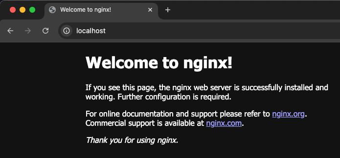

#### 설치
```shell
brew install helm
```

#### nginx 배포 예제
`Chart.yaml`
```yaml
apiVersion: v2
name: nginx
description: A Helm chart for Kubernetes
type: application
version: 0.1.0
appVersion: "1.16.0"
```

`values.yaml`
```yaml
replicaCount: 1
image:
  repository: nginx
  tag: stable
  pullPolicy: IfNotPresent
service:
  type: LoadBalancer
  port: 80
```

`templates/deployment.yaml`
```yaml
apiVersion: apps/v1
kind: Deployment
metadata:
  name: {{ .Values.nameOverride | default .Chart.Name }}
  labels:
    app: {{ .Values.nameOverride | default .Chart.Name }}
spec:
  replicas: {{ .Values.replicaCount }}
  selector:
    matchLabels:
      app: {{ .Values.nameOverride | default .Chart.Name }}
  template:
    metadata:
      labels:
        app: {{ .Values.nameOverride | default .Chart.Name }}
    spec:
      containers:
        - name: nginx
          image: "{{ .Values.image.repository }}:{{ .Values.image.tag }}"
          ports:
            - containerPort: 80
```

`templates/service.yaml`
```yaml
apiVersion: v1
kind: Service
metadata:
  name: {{ .Values.nameOverride | default .Chart.Name }}
  labels:
    app: {{ .Values.nameOverride | default .Chart.Name }}
spec:
  type: {{ .Values.service.type }}
  ports:
    - port: {{ .Values.service.port }}
      targetPort: {{ .Values.service.port }}
      protocol: TCP
      name: http
  selector:
    app: {{ .Values.nameOverride | default .Chart.Name }}
```

- 실행
```shell
helm install my-nginx .
```
- http://localhost
