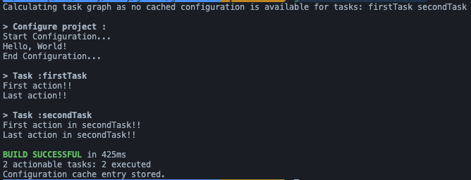

### Gradle Life Cycle

1. Initialization

- settings.gradle(.kts) 파일 찾아 Settings 인스턴스 생성
- 포함된 프로젝트들 찾아 Project 인스턴스 생성

2. Configuration

- build.gradle(.kts)로 task 그래프 생성

3. Execution

- 작업 간 종속에 따라 실행
- 병렬 실행 가능

```gradle
gradle firstTask secondTask
```


