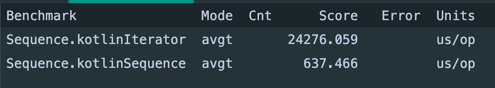
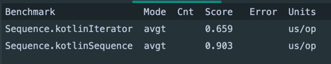

### 제네릭

- 제네릭, 타입 파라미터
- 무공변, 공변, 반공변
- 선언 지점 변성 / 사용 지점 변성
- 제네릭 제약, 제네릭 함수
- 타입 소거, Star Projection

> tip.
>
> - 코틀린에서는 Raw 타입 사용이 불가능
    > (타입 파라미터를 사용하지 않고 인스턴스화 하는것 )
>
> - 변성을 부여하지 않았다면 제네릭 클래스는 기본적으로 무공변
>
> - inline, reified 키워드를 이용해 타입 소거를 일부 막을 수 있다.
>
> - 타입 파라미터 섀도잉(클래스의 T가 함수의 T에 의해 shadowing)
>
> - 제네릭 클래스 상속시 같은 타입 파라미터를 전달 하거나 특정 타입을 전달
>
> - 타입에 별명을 붙일 수 있다.(typealias)

---

### 지연과 위임

- lateinit, lazy()
- by lazy 원리, 위임 프로퍼티
- 표준 위임 객체
    - notNull()
    - observable()
    - vetoable()
    - map
- ReadOnlyProperty
- ReadWriteProperty
- DelegateProvider
- 위임 클래스
- iterable, sequence
    - 성능 차이(200만 건)
      
    - 성능 차이(100 건)
      

> tip
> - lateinit 을 primitive type 에 사용할 수 없다. (Int, Long)
> - lateinit : 초기화를 지연시킨 변수, 초기화 로직이 여러 곳에 위치할 수 있다. 초기화 없이 호출하면 예외 발생
> - lazy : 초기화를 get 호출 전으로 지연시킨 변수, 초기화 로직은 변수 선언과 동시에 한 곳에만 위치 할 수 있다.
> - primitive type 에는 lateinit을 사용할 수 없지만, notNull()은 사용할 수 있다.
> - observable() 은 setter 가 호출될 때 onChange() 함수 호출
> - vetoable() 은 setter 가 호출될 때 onChange() 함수 호출 true 이면 변경 적용 false 이면 변경 X
> - 위임 객체 map 은 getter 호출 시 Map 에서 찾아 응답한다.
> - sequence 는 원소 하나씩 중간연산 실행 후 다음 원소로 넘어간다. 최종 연산이 없을 경우 실행 안함(지연 연산)

---

### 함수형 프로그래밍

- 고차함수와 함수 리터럴(람다식, 익명함수)
- inline 함수 , inline 프로퍼티
- SAM(Single Abstract Method) 과 reference

> tip
> - { } 를 활용해 람다식을 만들 수 있고 마지막 파라미터의 람다식은 () 바깥으로 뺄 수 있다.
> - 람다식은 반환 타입을 적을 수 없고 익명함수는 반환타입을 적을 수 있다.
> - 람다식 안에는 return 을 쓸 수 없고 익명함수 안에는 return 을 쓸 수 있다.
> - 고차함수를 사용ㅇ하게 되면 FunctionN 클래스가 만들어지고 인스턴스화 되어야 하므로 오버헤드가 발생 할 수 있다.
> - 함수에서 변수를 포획할 경우, 해당 변수를 Ref라는 객체로 감싸야 하기 때문에 오버헤드가 발생 할 수 있다.
> - noinline 키워드를 사용해 인라인을 막을 수 있다.
> - inline 함수는 non-local return 을 사용할 수 있게 해준다. (crossinline 으로 막을 수 있다.)
> - 코틀린에서는 SAM 이름 + 람다식으로 인스턴스화 할 수 있다.
> - 암시적인 SAM 인스턴스화를 할 경우 의도하지 않은 SAM 이 호출될 수 있다.
> - Java 에서는 호출 가능 참조 결과값이 Consumer / Supplier 같은 함수형 인터페이스 이지만 kotlin 에서는 리플렉션 객체이다.

---

### 연산자 오버로딩, Kotlin DSL
- [연산자 오버로딩](https://kotlinlang.org/docs/operator-overloading.html#unary-operations)
- DSL(Domain-Specific Language) : HTML, SQL 처럼 특정 목적을 위해 존재하는 언어 [참고](https://kotlinlang.org/docs/type-safe-builders.html#how-it-works)

> tip
> - 복합 대입 연산자(e.g : +=)의 오버로딩
>   1. 복합 대입 연산자 오버로딩이 되어있다면 바로 적용
>   2. 오버로딩이 없고 var 변수라면 산술연산자를 적용해 변수 업데이트
>   3. 오버로딩이 없고 val 변수라면 에러 발생
> - @DslMarker : 가장 가까운 수신객체에 대해서만 this를 생략할 수 있다.

---

### 어노테이션, 리플렉션
- annotation
- reflection
  - KClassifier, KAnnotatedElement, KClass, KType, KParameter
  - KTypeParameter, KCallable, KFunction, KProperty
- DI container
- 타입 안전 이종 컨테이너 패턴
- 슈퍼 타입 토큰

> tip
> - 어노테이션 사용은 named argument 사용 가능
> - 배열로 이루어진 어노테이션 필드는 [] 또는 arrayOf() 를 사용
> - 어노테이션을 사용하는 위치가 애매한 경우 어떤 요소에 붙였는지 알려주어야 한다.
>   -> use-site target(e.g @get:Shape) 기본 순서는 param > property > field
>   -> @Target 으로 지정하면 지정한 곳에 붙는다.
> - @Repeatable 어노테이션은 어노테이션을 반복해서 붙일 수 있게 해준다.