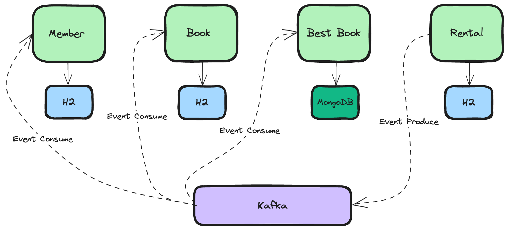
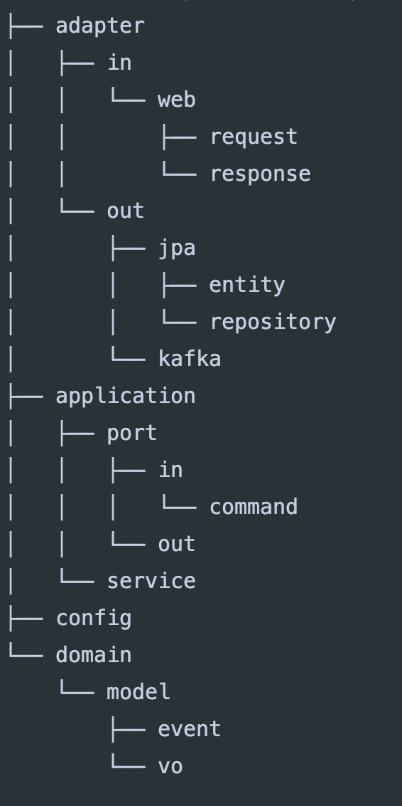

### 개요
- 간단한 이벤트 기반 마이크로 서비스 예제
- Java 11, Springboot, h2, mongoDB, kafka, swagger
- DDD & 헥사고날 아키텍쳐
- 유닛테스트, 통합테스트 코드

---

### Architecture


---

### Directory


### Infra
- [docker-compose-infra.yml](./docker-compose-infra.yml)
```shell
docker-compose -f docker-compose-infra.yml up -d
```

---

### 요구사항

회원관리

- 회원을 등록한다.
- 특정 회원은 관리자의 역할을 부여 받는다.
- 회원은 시스템 사용을 위해 로그인하거나 로그아웃 할 수 있다.

도서 관리

- 관리자는 도서분류정보를 등록/수정/삭제한다.
- 사내 도서관은 판교,정자에 위치한다.
- 도서는 도서공급사가 공급하거나 기부될 수 있다.
- 입고된 도서는 사서에 의해 분류된다.
- 사서는 분류한 도서의 상태(초기값: 대여 가능)를 설정하여 대여 가능토록 한다.
- 대여/반납에 의해 도서의 상태(대여 가능,대여 중) 조정된다.

도서 대여 및 반납

- 사용자는 도서를 검색할 수 있다.
- 사용자는 베스트 대여 목록을 조회할 수 있다.
- 사용자는 대여가능한 도서를 대여 할 수 있다.(대여 조건은 2주, 1인당 5권 이내이다.)
- 반납되지 않고 대여 기간이 지난 도서는 연체된다. 연체 시 연체 포인트가 1일 10포인트 부여된다.
- 1권이라도 연체되면 사용자는 대여 불가 상태가 된다.
- 사용자는 대여한 도서를 반납할 수 있다.
- 반납시 연체료가 계산된다.
- 사용자는 대여한 도서 이력을 볼 수 있다.
- 사용자가 도서를 대여하거나 반납 시 사용자에게 10 포인트가 적립된다.
- 연체가 있으면 대여할 수 없다.
- 대여된 도서는 모두 반납이 되어야지 대여 정지를 해제할 수 있다.
- 포인트를 활용하여 대여 정지를 해제할 수 있다.
- 포인트는 연체료를 감면할 수 있다.
- 연체포인트를 0으로 만들면 대출 가능 상태가 된다.

---

### 테스트 시나리오

| 순서  | 서비스      | 기능        | 기타               |
|-----|----------|-----------|------------------|
| 1   | Member   | 회원등록      ||
| 2   | Book     | 도서등록      | 도서A 최초상태확인(대여가능) |
| 3   | Rental   | 회원카드등록    ||
| 4   | Rental   | 도서대여      | 도서A              |
| 5   | Book     | 도서 상태확인   | 도서A 대여불가         |
| 6   | Member   | 포인트 부여    ||
| 7   | BestBook | 도서정보 생성   ||
| 8   | Rental   | 도서 반납     | 도서A              |
| 9   | Book     | 도서 상태확인   | 도서A 대여가능         |
| 10  | Member   | 포인트 부여 확인 ||
| 11  | Book     | 도서등록      | 도서B 최초상태확인(대여가능) |
| 12  | Rental   | 도서 대여     | 도서B              |
| 13  | Book     | 도서 상태확인   | 도서B 대여불가         |
| 14  | Member   | 포인트 부여    ||
| 15  | BestBook | 도서정보 생성   ||
| 16  | Rental   | 도서 연체     | 도서B              |
| 17  | Rental   | 도서카드 상태   | 대여정지             |
| 18  | Rental   | 연체도서반납    | 도서B              |
| 19  | Rental   | 연체해제처리    ||
| 20  | Member   | 포인트 사용    ||