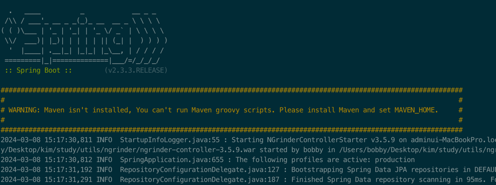
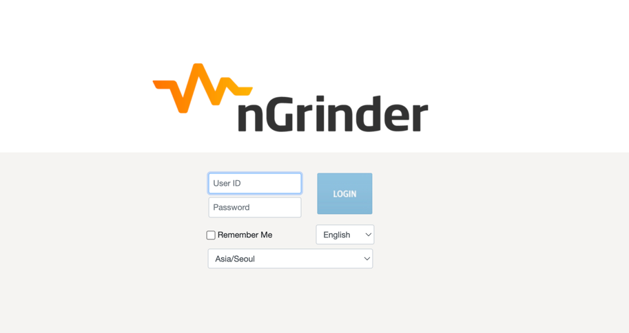
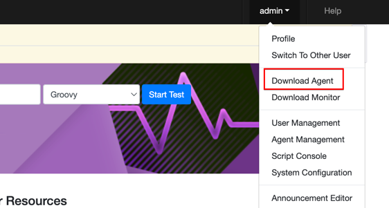
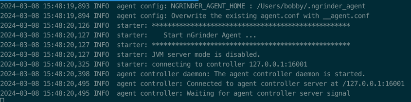
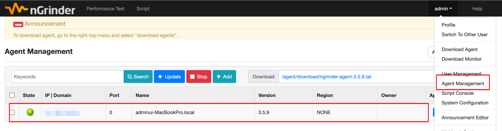
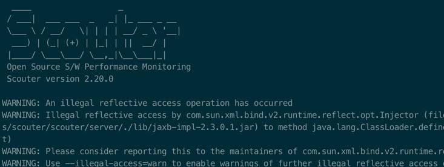
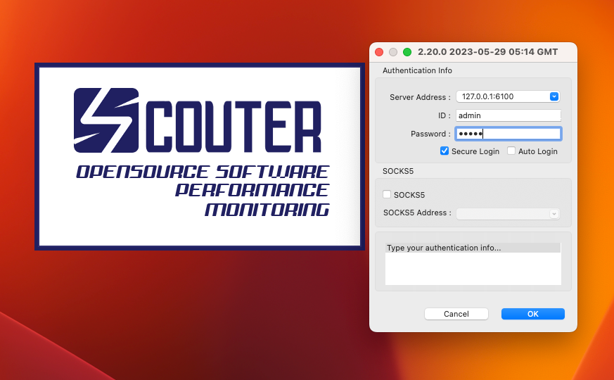
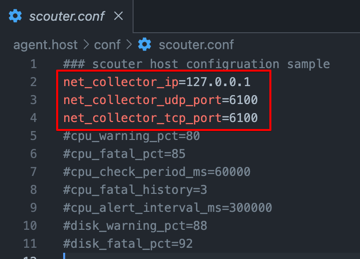
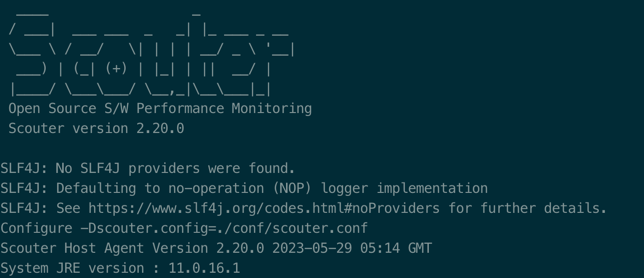

## 부하 테스트 툴 ngrinder 설치
### ngrinder controller 다운로드
-  Github : `https://github.com/naver/ngrinder/releases`

### 실행
```shell
java -jar ngrinder-controller-3.5.9.war --port=8300
```

> ❗️에러 발생시
> 
> Please set `java.io.tmpdir` property like following. tmpdir should be different from the OS default tmpdir.
> ```shell
> java -Djava.io.tmpdir=$(echo $HOME)/.ngrinder/temp -jar ngrinder-controller-3.5.9.war --port=8300
> ```



### 접속
- `http://localhost:8300`
- id/pw : `admin/admin`



### Agent 다운로드

- `ngrinder-agent-3.5.9-localhost.tar`
- 압축 해제 후 해당폴더 이동
- 실행
```shell
# mac
./run_agent.sh

# window
./run_agent.bat
```


- agent management 탭에 가면 확인 할 수 있다.


---

## 모니터링 툴 Scouter 설치

### 다운로드
-  Github : `https://github.com/scouter-project/scouter/releases`
- `scouter-all-[version].tar.gz` 다운로드
  - Scouter Collector와 Agent를 포함하는 압축파일
- `scouter.client.product-[os].tar.gz` 다운로드
  - 각 OS별 Client(Viewer) 프로그램

### 서버 실행
- 포트번호는 6100
- `scouter-all-[version].tar.gz` 압축 해제
```shell
#scouter 하위 server 하위 디렉토리 startup 실행
./startup.sh #mac
./startup.bat #window
```



### 클라이언트 실행
> ❗Mac 에서 실행 안될 경우 다음 명령어 실행
> 
> `xattr -cr scouter.client.app`



### Agent 실행
- `/scouter/agent.host/conf` 경로에 `scouter.conf` 설정 변경
  

- `/scouter/agent.host` 경로로 이동 후 실행

```shell
./host.sh #mac
./host.bat #window
```


### App 실행 시 옵션 추가하여 실행
```shell
java -jar -javaagent:{scouter 경로}/scouter/agent.java/scouter.agent.jar -Dscouter.config{scouter 경로}/scouter/server/conf/scouter.conf -Dobj_name={이름} --add-opens java.base/java.lang=ALL-UNNAMED app.jar
```