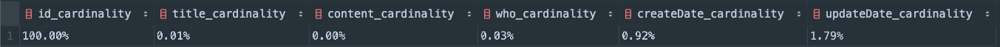
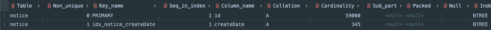
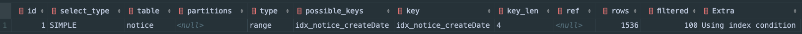
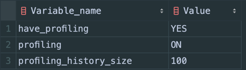
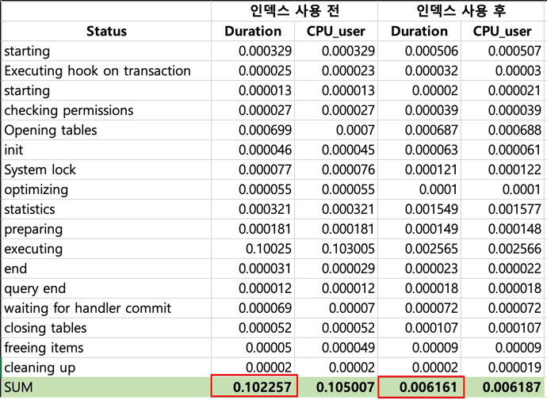
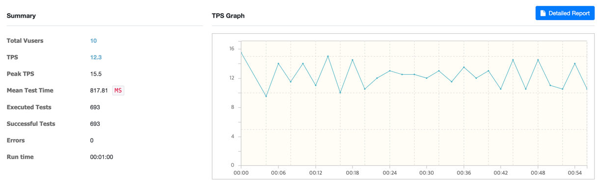

### 테스트 환경

|             | 버전     |
|-------------|--------|
| java        | 17     |
| spring boot | 3.2.3  |
| ehcache     | 3.10.8 |
| mysql       | 8.0.33 |
| gradle      | 8.5    |

### 테이블

```sql
CREATE TABLE `notice`
(
    `id`         bigint    NOT NULL AUTO_INCREMENT,
    `title`      varchar(30)  DEFAULT NULL,
    `content`    varchar(100) DEFAULT NULL,
    `who`        varchar(30)  DEFAULT NULL,
    `createDate` timestamp NOT NULL,
    `updateDate` timestamp NOT NULL,
    PRIMARY KEY (`id`)
) ENGINE = InnoDB
  AUTO_INCREMENT = 0
  DEFAULT CHARSET = utf8mb4;
```

---

### 캐시 활용 성능 향상

#### 공지사항 전체 데이터 조회

- `GET /api/notices`
- 테스트 조건
    - Vuser: 10
    - Duration: 60s

- 캐시 적용 전
  

- 캐시 적용 후
  

- 수치 비교

| 항목                 | 적용 전   | 적용 후   |
|--------------------|--------|--------|
| 평균 TPS             | 79.4   | 465.7  |
| Peek TPS           | 91.5   | 622.5  |
| Mean Test Time(ms) | 124.47 | 20.28  |
| Executed Test      | 4,459  | 27,090 |

#### 공지사항 데이터 조회(page)

- `GET /api/notices/{pageNo}`
- 테스트 조건
  - Vuser: 10
  - Duration: 60s

- 캐시 적용 전
  

- 캐시 적용 후
  

- 수치 비교

| 항목                 | 적용 전    | 적용 후     |
|--------------------|---------|----------|
| 평균 TPS             | 2,205.6 | 12,795.1 |
| Peek TPS           | 3,324.5 | 14,716.5 |
| Mean Test Time(ms) | 3.72    | 0.65     |
| Executed Test      | 123,882 | 743,380  |

---

### 인덱스 활용하여 성능 향상

#### 인덱스 설정
- 6만건의 더미데이터 활용
- where, join 등에 사용되는 컬럼 분석
  ```sql
  -- 카디널리티 수치 확인
  SELECT
    CONCAT(ROUND(COUNT(DISTINCT id) / COUNT(*) * 100, 2), '%') AS id_cardinality,
    CONCAT(ROUND(COUNT(DISTINCT title) / COUNT(*) * 100, 2), '%') AS title_cardinality,
    CONCAT(ROUND(COUNT(DISTINCT content) / COUNT(*) * 100, 2), '%') AS content_cardinality,
    CONCAT(ROUND(COUNT(DISTINCT who) / COUNT(*) * 100, 2), '%') AS who_cardinality,
    CONCAT(ROUND(COUNT(DISTINCT createDate) / COUNT(*) * 100, 2), '%') AS createDate_cardinality,
    CONCAT(ROUND(COUNT(DISTINCT updateDate) / COUNT(*) * 100, 2), '%') AS updateDate_cardinality
  FROM notice;
  ```
  

- 인덱스 생성
  ```sql
  -- 인덱스 생성
  CREATE INDEX idx_notice_createDate ON notice ( createDate );
  
  -- 인덱스 확인
  show index from notice;
  ```
  
  
- 실행계획
  ```sql
  EXPLAIN
  SELECT * FROM notice
  WHERE createDate BETWEEN '2023-01-15 00:00:00' AND '2023-02-14 23:59:59';
  ```
  

- Profiling
  ```sql
  -- profiling 기능 활성화하기
  set profiling=1;
  set profiling_history_size=100;
  
  -- 확인
  show variables like '%profiling%';
  ```
  
  ```sql
  -- query_id 찾기
  show profiles ;  
  
  -- 해당 쿼리 분석
  show profile cpu for query 47;
  ```
- 수치 비교
  
  

#### 공지사항 데이터 조회(date)

- `GET /api/notices/dates`
- 테스트 조건
  - Vuser: 10
  - Duration: 60s

- 인덱스 적용 전
  

- 인덱스 적용 후
  

- 수치 비교

| 항목                 | 적용 전   | 적용 후   |
|--------------------|--------|--------|
| 평균 TPS             | 12.3   | 187.8  |
| Peek TPS           | 15.5   | 210.0  |
| Mean Test Time(ms) | 817.81 | 50.84  |
| Executed Test      | 693    | 10,918 |
