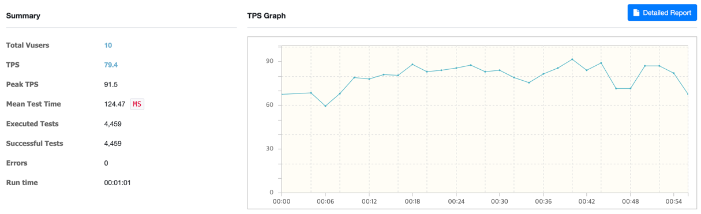
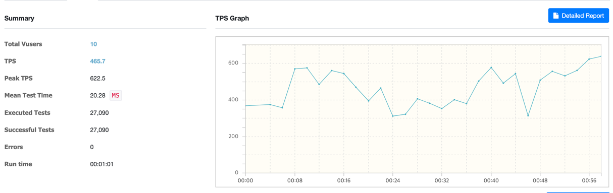
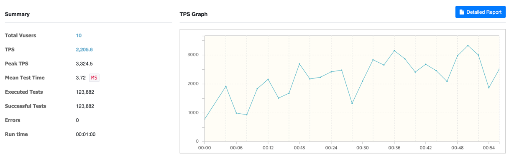
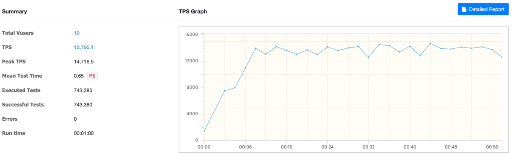

### 테스트 환경

|             | 버전     |
|-------------|--------|
| java        | 17     |
| spring boot | 3.2.3  |
| ehcache     | 3.10.8 |
| mysql       | 8.0.33 |
| gradle      | 8.5    |

### 테이블

```sql
CREATE TABLE `notice`
(
    `id`         bigint    NOT NULL AUTO_INCREMENT,
    `title`      varchar(30)  DEFAULT NULL,
    `content`    varchar(100) DEFAULT NULL,
    `who`        varchar(30)  DEFAULT NULL,
    `createDate` timestamp NOT NULL,
    `updateDate` timestamp NOT NULL,
    PRIMARY KEY (`id`)
) ENGINE = InnoDB
  AUTO_INCREMENT = 0
  DEFAULT CHARSET = utf8mb4;
```

---

### ngrinder 활용 부하테스트

#### 공지사항 전체 데이터 조회

- `GET /api/notices`
- 테스트 조건
    - Vuser: 10
    - Duration: 60s

- 캐시 적용 전
  

- 캐시 적용 후
  

- 수치 비교

| 항목                 | 적용 전   | 적용 후   |
|--------------------|--------|--------|
| 평균 TPS             | 79.4   | 465.7  |
| Peek TPS           | 91.5   | 622.5  |
| Mean Test Time(ms) | 124.47 | 20.28  |
| Executed Test      | 4,459  | 27,090 |

#### 공지사항 데이터 조회(page)

- `GET /api/notices/{pageNo}`
- 테스트 조건
  - Vuser: 10
  - Duration: 60s

- 캐시 적용 전
  

- 캐시 적용 후
  

- 수치 비교

| 항목                 | 적용 전    | 적용 후     |
|--------------------|---------|----------|
| 평균 TPS             | 2,205.6 | 12,795.1 |
| Peek TPS           | 3,324.5 | 14,716.5 |
| Mean Test Time(ms) | 3.72    | 0.65     |
| Executed Test      | 123,882 | 743,380  |

---

