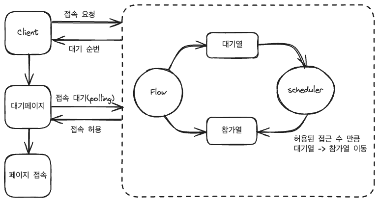
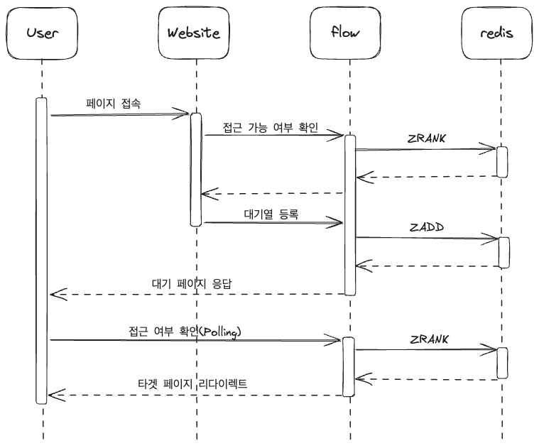

## 접속자 대기열 시스템

---

### Website
- java 17
- thymeleaf
- spring mvc

---

### Flow(대기열 흐름 제어 서버)
- java 17
- spring webflux
- thymeleaf
- reactive redis

---

### Flow
- 페이지 접속 요청
- 접속 가능 여부 확인
  - 접속 가능 -> 요청한 페이지 접속
  - 접속 불가능 -> 대기번호(접속토큰) 발급
- 접속 대기시 대기 페이지 이동
- 주기적으로 접속 가능 여부 확인(polling)
  - 스케줄러가 1초마다 허용된 접근 수를 확인 하여 대기열 > 참가열 이동
- 접속 허용시 요청한 페이지 접속

---

### Sequence

