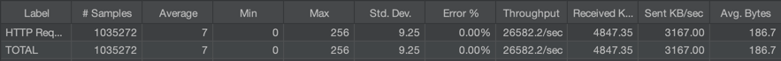
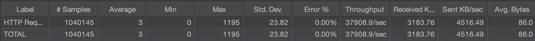
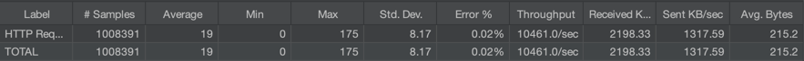
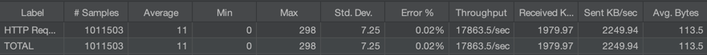
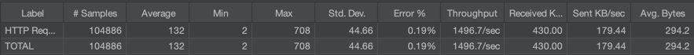
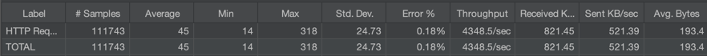

## Spring MVC vs Spring Webflux 성능테스트

### Jmeter 설치
```shell
brew install jmeter
```

- Number of threads(users) : 200
- Ramp-up period (seconds) : 1

#### Non I/O
`/health`

- mvc

- webflux


#### Redis I/O
`/users/1/cache`

- mvc

- webflux


#### Mysql I/O
`/users/1`

- mvc

- webflux
