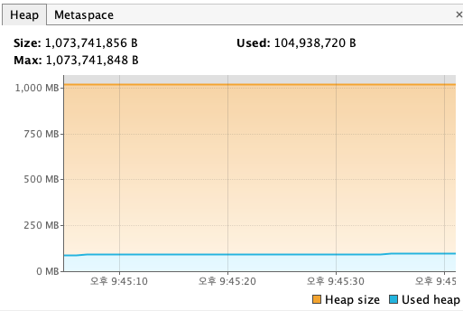
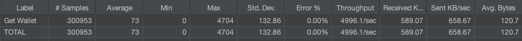
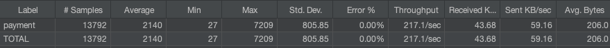

### 테스트 환경
- VmOption: -Xms1024m -Xmx-1024m
- Thread count: min: 10, max: 200
- Connection pool size: 10

### Visual VM
- https://visualvm.github.io/download.html

---

### JMeter

- Get Wallet

- Payment

---

### nGrinder
- https://github.com/naver/ngrinder/wiki/Installation-Guide